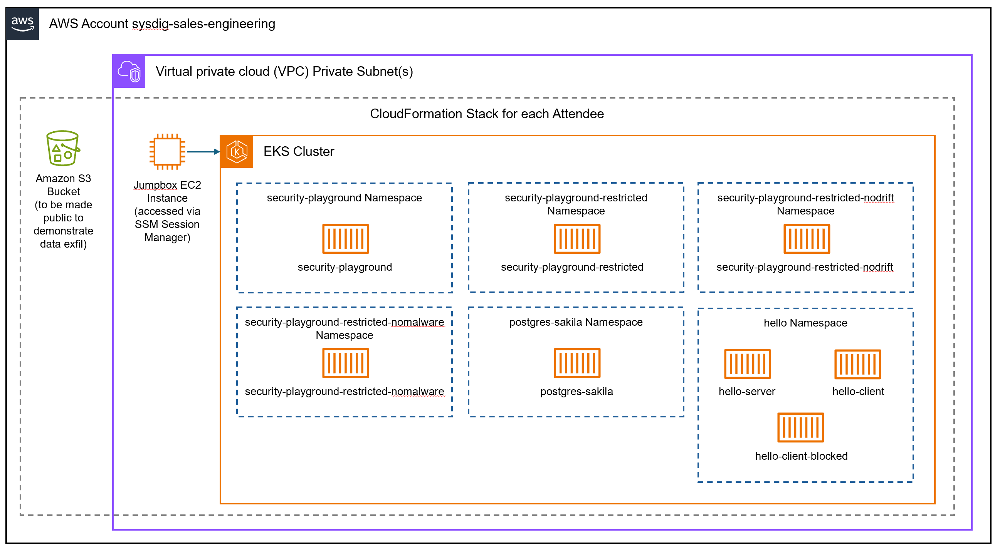
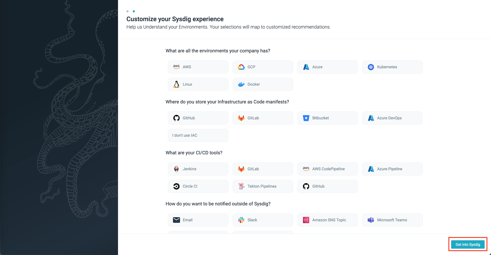
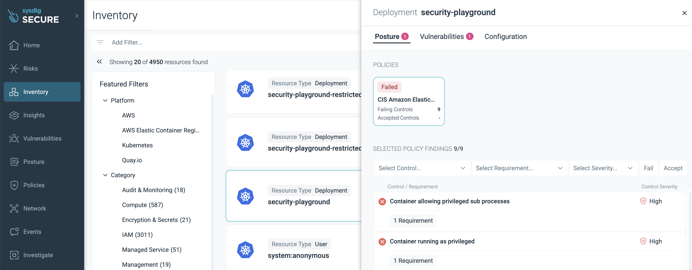
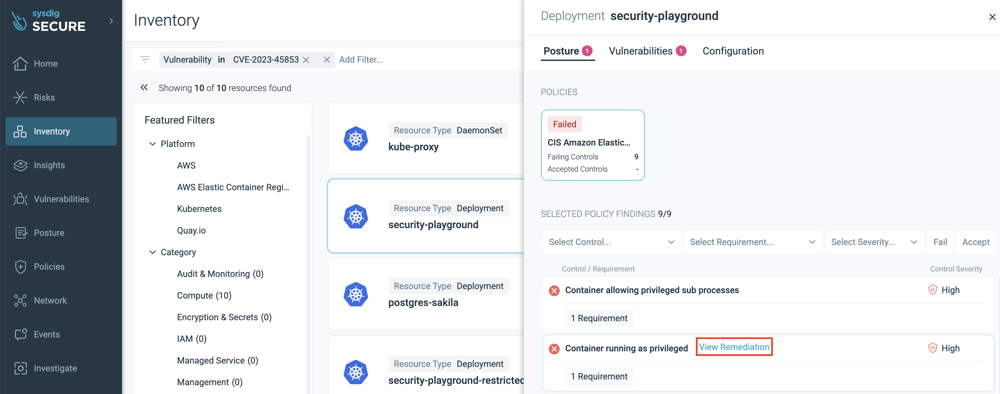
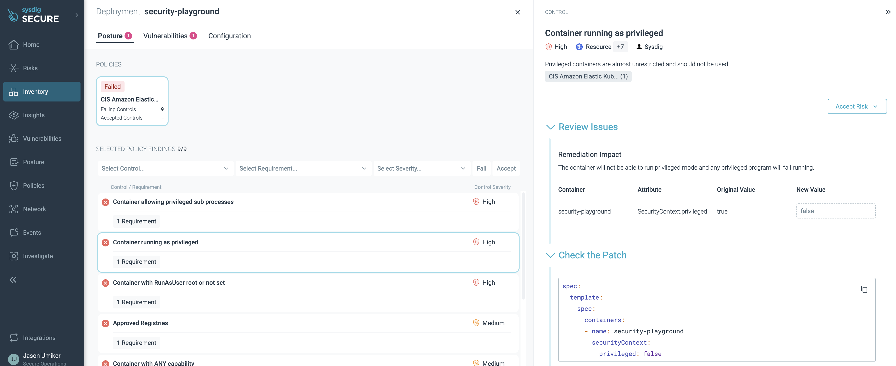
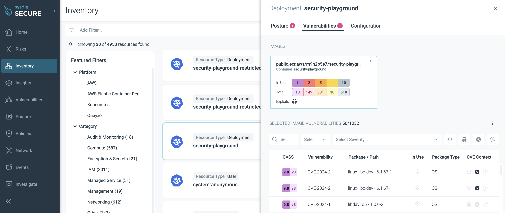
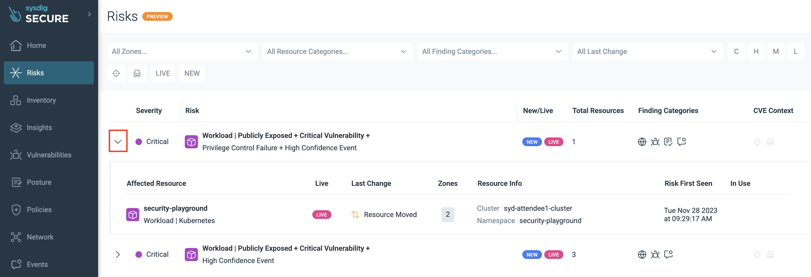
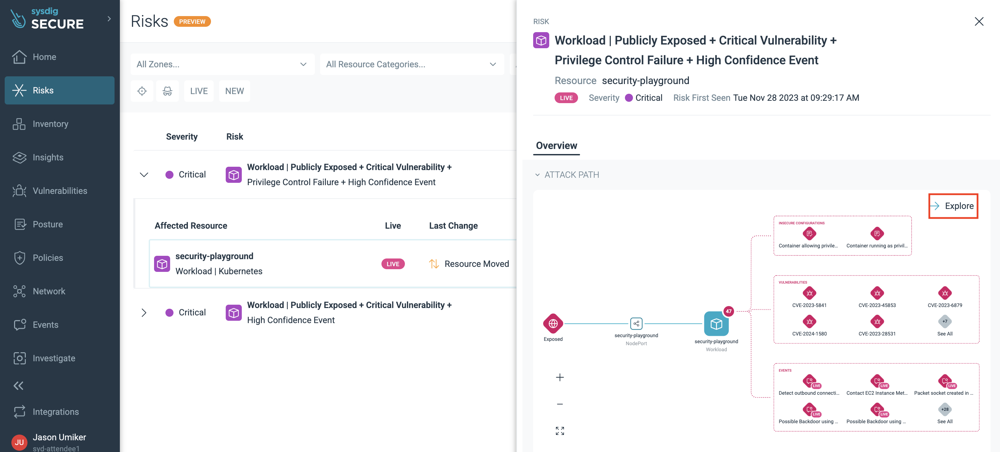
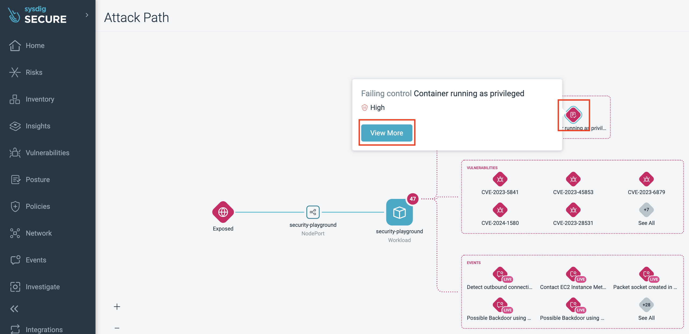
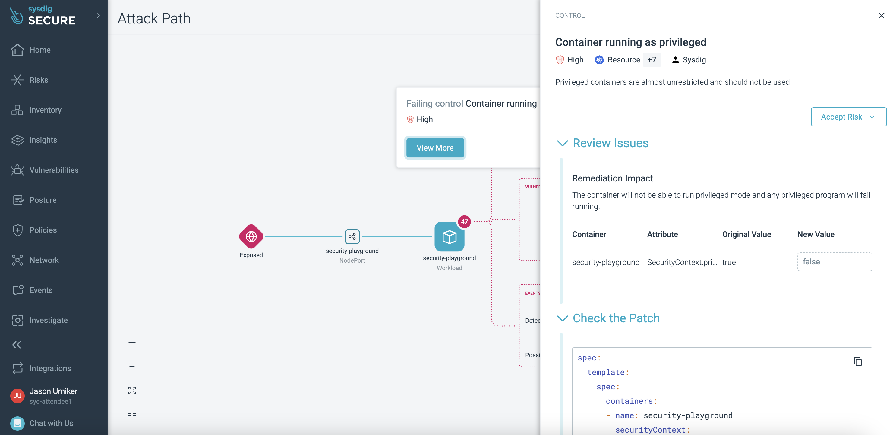

# Sysdig ハンズオン EKS セキュリティワークショップ

Sysdigのハンズオンワークショップへようこそ。このワークショップでは、Kubernetes/EKSのセキュリティ上の課題を実際に体験していただき、Sysdigがどのようにお役に立てるかをご紹介します。

私たちは、皆さんのために個別のEKSクラスタとEC2インスタンス（ジャンプボックスとして機能する）をプロビジョニングしました。ブラウザからAWS SSM Session Managerを経由してジャンプボックスに接続し、EKSクラスタを操作します。ジャンプボックスには本日のラボで作業するために必要なすべてのツールがプリロードされています。



また、Sysdig Secure内にユーザーをプロビジョニングしました。このSysdig SaaSのテナントは本日のワークショップに参加する全員で共有されますが、あなたのログインユーザーはチームに紐付けられており、あなたのEKSクラスタ環境に関する情報のみが表示されるようにフィルタリングされています。

## 環境へのログイン

### AWS 環境

講師から IAM ユーザー名とパスワードを受け取っているはずです。自分の環境にサインインするには

1. ウェブブラウザを開き、https://sysdig-sales-engineering.signin.aws.amazon.com/console/ にアクセスします。
1. プロンプトが表示されたら、AWS Account IDに **sysdig-sales-engineering** と入力されていることを確認します。
1. 提供された IAM ユーザー名とパスワードを入力し、**Sign in** ボタンをクリックします。
    1. 
1. コンソール右上のドロップダウンから **Sydney** リージョンを選択します。
    1. 
1. EC2サービスのコンソールに移動します（上部の検索ボックスにEC2と入力し、検索結果のEC2サービスをクリックできます）。
1. Resourcesの下にある **Instances (running)** リンクをクリックし、実行中のEC2インスタンスのリストに移動します。
    1. 
1. **Find instance by attribute or tag** 検索ボックスに**AttendeeXX**（XXはユーザー名の末尾の出席者番号）と入力し、エンター(リターン）を押します。2台のEC2インスタンが表示されますが、Name欄にAttendeeXXJumpboxと記載されているt3.smallのEC2インスタンスがジャンプボックスです。
1. ジャンプボックスの隣にあるボックスにチェックを入れ、上部の**Connect**ボタンをクリックします。
    1. 
1. **Session Manager**タブを選択し、**Connect**ボタンをクリックします。
    1. 
1. ターミナルウィンドウが開いたら、`sudo bash` と入力してから、`cd /root` と入力します。
    1. **注意:** セッションマネージャーセッション（ターミナルウィンドウ）を閉じて再度開くと、rootユーザーとそのホームディレクトリに戻るために、これら2つのコマンドを再度実行する必要があります。
1. `kubectl get pods -A`と入力すると、EKSクラスタ内の実行中のPodの一覧が表示されます。

> **注意:** ワークショップを通してGitHub上のサンプルファイルをいくつか紹介しますが、実行に必要なものはすべてジャンプボックスの/rootにあらかじめインストールされています。GitHubから何かをコピー＆ペーストしたり、**git clone**したりする必要はありません。

### Sysdig環境

講師から Sysdig へのログイン名とパスワードを受け取っているはずです（パスワードはAWSログインのパスワードと同じです）。自分の環境にサインインします：

1. ウェブブラウザを開き、https://app.au1.sysdig.com/secure/ にアクセスします。
1. 自身に提供されたメールアドレスとパスワードを入力し、**Log in**ボタンをクリックします。
1. Sysdig エクスペリエンスのカスタマイズ画面が表示されたら、右下の **Get into Sysdig** ボタンをクリックし、**Home** 画面に移動します。
    1. 

## モジュール 1 - ランタイム脅威の検知と防御 (Workload/Kubernetes)

最初のモジュールでは、ランタイム脅威の検知と防御に関する Sysdig の機能について説明します。

攻撃者がどのように侵入してくるかにかかわらず、攻撃者の行動は多くの点で共通しています。予測可能な一連の行動は、[MITRE ATT&CK Framework](https://attack.mitre.org/)によって詳細に説明されています。Sysdigの脅威リサーチチームは、世界中に大規模なハニーポットを設置し、攻撃者が侵入後にどのような行動を取るかを直接学んでいます。そして、すべてのお客様に代わって、[Rules](https://docs.sysdig.com/en/docs/sysdig-secure/policies/threat-detect-policies/manage-rules/) (何を検知べきか)と[Managed Policies](https://docs.sysdig.com/en/docs/sysdig-secure/policies/threat-detect-policies/manage-policies/) (見つけたときに何をすべきか)のライブラリを継続的に更新しています。また、ご希望であれば、弊社が提供するものを超えて、お客様独自のカスタム（Falco）ルールおよび(または)ポリシーを作成することも可能です - これは完全に透過的であり、魔法のブラックボックスではなく、オープンソースのツール/標準に基づいています！

当社のAgentは、お客様の**ポリシー**で定義された様々な活動に対して、継続的に**ルール**と照らし合わせ、**イベント**を見つけたときに関連するすべてのコンテキストとともにリアルタイムでトリガーします。監視対象として下記以外にも、他の一般的なクラウド/SaaSサービスなどが近日中にさらに追加される予定です（GitHub、Oktaなど）：
* ノード/コンテナのLinuxカーネルシステムコール
* Kubernetesの監査証跡
* AWS、Azure、GCPの監査証跡

伝統的な "ルール/ポリシー "ベースのアプローチに加え、脅威検知/防止機能を強化する3つの機能があります：
* [ドリフト・コントロール](https://docs.sysdig.com/en/docs/sysdig-secure/policies/threat-detect-policies/manage-policies/container-drift/) - コンテナ・イメージに含まれていない実行可能ファイルの実行を検知し、オプションでその実行をブロックすることができます。
* [クリプトマイニングML検知](https://docs.sysdig.com/en/docs/sysdig-secure/policies/threat-detect-policies/manage-policies/machine-learning/) - クリプトマイニングの検知に特化した機械学習モデルを採用しています。
* マルウェア（プレビュー） - 実行しようとするマルウェア（私たちがウォッチしているいくつかの脅威フィードで定義されている）を検知することができます。

### Sysdig 内でイベントを生成するための攻撃のシミュレーション

1. Sysdig UI で左側の **Threats > Activity > Kubernetes** をクリックします。
    1. すでにいくつかのイベントが検知されているかもしれません。何も疑わしいアクティビティを検知していない場合は、**Welcome to Insights** プレースホルダ画面が表示されます。
1. それでは、イベントを生成してみましょう！
    1. 次のリンクをクリックして、クラスタ上のsecurity-playgroundサービスの、安全ではないコードを開いて中身を確認してください - https://github.com/jasonumiker-sysdig/example-scenarios/blob/main/docker-build-security-playground/app.py
        1. このPythonアプリは、単純な **curl** コマンドに応答して、ファイルシステム上の任意のファイルの内容を返したり、ファイルシステム に任意のファイルを書き込んだり、ファイルシステム上の任意のファイルを実行したりする**極めて**安全ではないREST APIを提供します。
            1. そして、それらを組み合わせて、ファイルをダウンロード/書き込みしたり、実行することができます。
        1. これは、深刻なリモートコード実行(RCE)の脆弱性をシミュレートしています。
            1. このアプリを使って、脆弱性が悪用された時に何を検知するかをテストすることができます。
    1. ジャンプボックスのセッションマネージャ端末のブラウザタブに戻ってください。
    1. security-playground サービスに対して実行するいくつかの **curl** コマンド例を含むスクリプトを見るために、`cat ./example-curls.sh` と入力してください。このスクリプトは以下を実行します：
        1. 機密パス **/etc/shadow** の読み取り。
        1. ファイルを **/bin** に書き込み、**chmod +x** して実行する。
        1. **apt**から**nmap**をインストールし、ネットワークスキャンを実行する。
        1. **nsenter**コマンドを実行して、コンテナLinuxのネームスペースをホストに「ブレークアウト」する。
        1. Nodeのコンテナランタイムに対して**crictl**コマンドを実行する（KubernetesとKubeletをバイパスして直接管理する） 。
        1. **crictl**コマンドを使用して、同じNode上の別のPodからKubernetesシークレットを取得する（実行時に環境変数に復号化されたもの）。
        1. **crictl**コマンドを使用して、同じNode上の別のPod内でPostgres CLI **psql**を実行し、機密データを流出させる。
        1. KubernetesのCLIである**kubectl**を使って、別の悪意のあるワークロードを起動する（security-playgroundのために過剰な権限でプロビジョニングされたKubernetesのServiceAccountを悪用する）。
        1. security-playground PodからNodeのAWS EC2 Instance Metadataエンドポイントに対して**curl**コマンドを実行する。
        1. 最後に、xmrig クリプトマイナーを実行する。
    1. 次に、`./example-curls.sh`と入力してスクリプトを実行し、攻撃者の視点から返されるすべての出力を確認してください。
    1. 次に、Sysdig UIタブに戻り、ブラウザのタブを更新します。
        1. どのクラスタ、ネームスペース、Pod からランタイムイベントが発生しているかを示す円形の視覚化/ヒートマップが左側に表示されます。
        1. また、右側の **Summary** タブにはそれらのイベントのサマリーが、**Events** タブにはそれらのイベントの完全なタイムラインが表示されます。
        1. 
    1. 右側の**Events**タブを選択します。
    1. ご覧のように、Sysdigがリアルタイムで検知したイベントが多数あります！
        1. 
    1. **Detect outbound connections to common miner pools**イベントをクリックしてからスクロールすると、プロセス、ネットワーク、AWSアカウント、Kubernetesクラスタ/ネームスペース/デプロイメント、ホスト、コンテナの詳細を含む、そのイベントのすべてのコンテキストを確認することができます。
       1. 特にプロセスツリービューを見ると、Pythonアプリが暗号マイナーのxmrigを起動するシェルを起動していることがわかります！
       1. 
       1. **Explore**をクリックすると、このプロセスツリーの詳細とこの環境内の履歴を見ることができます。
       1. 
       1. このビューは、右側にある実行ファイル(xmrig)に関連する他の全てのイベントを表示するだけでなく、apt-get、nmap、nsenterなど、起こっている他の全てのことを表示します。
       1. 
1. イベントを理解する
    1. **Threats > Activity > Kubernetes**画面に戻り、再び**Events**タブを表示します。最も古い/最初のイベントまでスクロールダウンし、それぞれの詳細/コンテキストをすべて明らかにするために、それぞれのイベントをクリックしてください。ここでピックアップしたものは以下の通りです：
        1. **Read sensitive file untrusted** - ウェブサービスが行うべきでない **/etc/shadow** ファイルの読み取り。
        1. **Drift Detection** - 元のイメージにはなかった実行ファイルがコンテナに追加され、それが実行された。
            1. 実行時にコンテナに変更を加えるのはベストプラクティスではありません。むしろ、新しいイメージをビルドし、イミュータブル（不変）パターンでサービスを再デプロイすべきです。
        1. **Launch Package Management Process in Container** - **Drift Detection**と同様に、実行中のコンテナでapt/yum/dnfを使用してパッケージを追加または更新すべきではありません。その代わりに、コンテナイメージのビルドプロセスの一部として、**Dockerfile**で実行してください。
        1. **Suspicious network tool downloaded and launched in container** - 攻撃者がスキャンを実行し、悪用したワークロードがどのネットワークにあるのか、つまり他に何ができるのかを調べようとするのは、一般的な初期段階の行動です。
        1. **The docker client is executed in a container** - これは **docker** CLI だけでなく、**crictl** や **kubectl** といった他のコンテナ CLI の実行を含みます。
            1. コンテナがKubernetesクラスタ上のコンテナランタイム/ソケットと直接会話しようとするのは珍しいことです！
        1. **Contact EC2 Instance Metadata Service From Container** - EKS Podsは、[IAM Roles for Service Accounts (IRSA)](https://docs.aws.amazon.com/eks/latest/userguide/iam-roles-for-service-accounts.html) などの他の手段を使ってAWSとやり取りする必要があります。その代わりにノードを経由して認証情報を使用するのは疑わしい行動です。
        1. **Malware Detection** - Sysdigは脅威フィードから多くのマルウェアのファイル名とハッシュを探し出します。ここで検知されたクリプトマイナーのxmrigも対象の一つです。
            1. マルウェアの実行をブロックすることもできます！（この後のラボで実際に試します）
        1. **Detect outbound connections to common miner pool ports** - ネットワーク・トラフィックをレイヤー3で調べ、宛先がクリプトマイナー・プールや[Tor](https://www.torproject.org/)エントリー・ノードのような不審なものである場合に検知します。

これは、サービスの一部としてすぐに利用できるルールのほんの一部です！

(オプション）すべてのマネージドポリシー（左側メニューの **Policies > Threat Detection > Runtime Policies** に移動します）とルールライブラリ（**Policies** に移動し、**Rules** のメニューを展開して **Rules Library** を選択します）を見てください。各ルールをクリックして、FalcoのYAML記述を確認してください（これは "魔法のブラックボックス "ではないので、独自のルールを書くことができることに注目してください）。

### Activity Audit
上記で確認したことに加えて、Activity Auditでは、実行されたすべての対話型コマンドと、関連するファイルとネットワークのアクティビティもキャプチャします。

これはすべて同じタイムラインに集約され（もちろんフィルタリングすることも可能です）、マシン間を行き来するユーザーの横方向の動きを確認するのに役立ちます。

Sysdig AgentはどのLinuxマシンにもインストールすることができ、このラボ環境ではEKSクラスタに加えてジャンプボックスにもインストールされています。つまり、ワークショップでこれまでに実行したすべての対話型コマンドはキャプチャされたことになります！もし誰かがEKSノードにSSHでアクセスしたり、Agentがインストールされている場所でコマンドを実行した場合も、同じようにキャプチャされます。

これを確認するには、左側メニューの**Threats > Forensics > Activity Audit**に行きます。

その後、**cmd**の1つをクリックして詳細を確認してください。

### この攻撃はなぜ成功したのでしょうか? 

この攻撃が成功するためには、多くの条件が当てはまらなければなりません：
1. 私たちのサービスがリモートでコードを実行される脆弱性があること。これは、私たち自身のコードが脆弱であること（今回のケースのように）、あるいは私たちのアプリが使用しているオープンソースパッケージ（pip、npm、maven、nugetなど）が脆弱であることのいずれかによる可能性があります。
1. 私たちが **curl** でアクセスしていたサービスは、**root** として実行されていました - そのため、コンテナのファイルシステム内のすべてを読み書きできるだけでなく、コンテナからホストにエスケープするときも root でした！
1. PodSpecは[**hostPID: true**](https://github.com/jasonumiker-sysdig/example-scenarios/blob/3da34f8429bd26b82a3ee2f052d2b654d308990f/k8s-manifests/04-security-playground-deployment.yaml#L18)と[privrivileged **securityContext**](https://github.com/jasonumiker-sysdig/example-scenarios/blob/3da34f8429bd26b82a3ee2f052d2b654d308990f/k8s-manifests/04-security-playground-deployment.yaml#L35)を持っていたため、コンテナ境界(実行中のLinuxネームスペース)からホストにエスケープすることができました。
1. 攻撃者は、実行時に**nmap**や暗号マイナーの**xmrig**のような新しい実行可能ファイルをコンテナに追加して実行することができました。
1. 攻撃者はインターネットからこれらのものをダウンロードすることができました（このPodはそのEgressを介してインターネット上のあらゆる場所に到達することができたため）。
1. 私たちのサービスの ServiceAccount は過剰にプロビジョニングされており、K8s API を呼び出して他のワークロードを起動することができました（本来これは必要ありません）。
    1. `kubectl get rolebindings -o yaml -n security-playground && kubectl get roles -o yaml -n security-playground` を実行して、デフォルトの ServiceAccount に以下のルール/パーミッションでバインドされた Role があることを確認します：
        ```
        rules:
        - apiGroups:
            - '*'
            resources:
            - '*'
            verbs:
            - '*'
        ```
    1. 上記はClusterRoleではなくRoleでした - つまり、できることはこのNamespace内に限られるということです。しかし、Namespaceの中で完全な管理者として与えられるダメージはたくさんあります！
1. 攻撃者はPod内から、EKSノードだけを対象としたEC2メタデータのエンドポイント（169.254.0.0/16）に到達できました。

これらはすべて修正できます：
* ワークロードの設定（Kubernetesの新しい[Pod Security Admission](https://kubernetes.io/docs/concepts/security/pod-security-admission/)で設定を強制できるようになりました。）
* Sysdig SecureのContainer Drift防止機能を利用できます。
* そして残りは、インターネットへのEgressネットワーク・アクセスを制御します。

そして、この3つをすべて実行すれば、（単に攻撃を検知するだけでなく）攻撃全体を防ぐことができます！

### このワークロードを修正する方法（security-playground）

上記の各原因について、解決策を示します：
1. このケースで脆弱性を修正するには、静的アプリケーション・セキュリティ・テスト（SAST）製品を使って、安全でない コードを特定します。私たちのパートナーである[Snyk](https://snyk.io/product/snyk-code/)は、選択肢の一つです。
    1. 
    1. 代わりに、これがアプリ/コンテナ内の既知/公開の CVE（Log4Jなど）に基づくものであれば、Sysdigの脆弱性管理（今後のモジュールで取り上げます）がこれを検出し、コンテナのベースレイヤーまたはコードパッケージのいずれかに、脆弱性のない更新バージョンへのパッチを適用するよう知らせてくれるでしょう。
1. このコンテナをnon-rootで実行するには、実際には以下の方法でDockerfileを変更する必要があります。こちらが変更前の[Dockerfile](https://github.com/jasonumiker-sysdig/example-scenarios/blob/main/docker-build-security-playground/Dockerfile)で、こちらが変更後の[Dockerfile](https://github.com/jasonumiker-sysdig/example-scenarios/blob/main/docker-build-security-playground/Dockerfile-unprivileged)です。
    1. docker build の一部として、[使用するユーザとグループを追加する](https://github.com/jasonumiker-sysdig/example-scenarios/blob/main/docker-build-security-playground/Dockerfile-unprivileged#L3) 必要があります。
    1. Dockerfileに、[デフォルトでそのユーザとして実行するよう指定する](https://github.com/jasonumiker-sysdig/example-scenarios/blob/main/docker-build-security-playground/Dockerfile-unprivileged#L8) 必要があります（これはあくまでデフォルトであり、実行時に上書きすることができます - restricted PSAやアドミッションコントローラがブロックしなければ）。
    1. ユーザー/グループが読み取りと実行（そしておそらく書き込みも）のパーミッションを持つフォルダにアプリを置く必要があります - この場合、元の/appではなく、[新しいユーザーのホームディレクトリを使用します](https://github.com/jasonumiker-sysdig/example-scenarios/blob/main/docker-build-security-playground/Dockerfile-unprivileged#L9)
    1. 最近のKubeCon Europeでは、最小特権コンテナの構築に関する素晴らしい講演があり、さらに深い内容を学ぶことができます - https://youtu.be/uouH9fsWVIE
1. PodSpecから安全でないオプションを削除します。しかし、理想的には、このようなオプションをPodSpecに入れられないようにする必要があります。
    1. Kubernetesに組み込まれた[Pod Security Admission](https://kubernetes.io/docs/concepts/security/pod-security-admission/)機能(1.25でGAになった)で、PodSpecに入れられないように強制することができます。
        1. これは[各Namespaceにラベルを追加する](https://kubernetes.io/docs/tasks/configure-pod-container/enforce-standards-namespace-labels/)ことで機能します。baselineとrestrictedの2つの基準を使って、警告したり強制したりすることができます。
            1. [baseline](https://kubernetes.io/docs/concepts/security/pod-security-standards/#baseline) - HostPidやPrivilegedなど、PodSpecの最悪のパラメータは使用できませんが、コンテナをrootとして実行することはできます。
            1. [restricted](https://kubernetes.io/docs/concepts/security/pod-security-standards/#restricted) - rootでの実行を含む、すべての安全でないオプションをブロックします。
    1. また、Sysdig には Posture/Compliance 機能があり、デプロイ前に IaC をスキャンしたり、実行時に問題を修正したりすることができます。
1. ドリフト・コントロール（Drift Control）機能で、実行時に追加される新しいスクリプト/バイナリの実行をブロックすることができます（今回はドリフトを防止するのではなく、検知するだけです）。
1. KubernetesのNetworkPolicyか、各サービスが到達可能な宛先の許可リストを使用して、インターネットに到達するために明示的に認証されたプロキシを経由させることによって、インターネットへのPod（複数可）のEgressアクセスを制限することができます。
1. Kubernetes APIへの不要なアクセスを許可するデフォルトのServiceAccountによる、Kubernetes APIへのRoleとRoleBindingを削除することができます。
1. 上記のようにNetworkPolicyでPodの169.254.0.0/16へのEgressアクセスをブロックするか、AWSのドキュメントに記載されているようにIDMSv2で最大1ホップに制限するか、どちらかです - https://docs.aws.amazon.com/whitepapers/latest/security-practices-multi-tenant-saas-applications-eks/restrict-the-use-of-host-networking-and-block-access-to-instance-metadata-service.html

### 実際に修正する
私たちは、**この攻撃はなぜ成功したのでしょうか?** の1から3が修正されたワークロードの例として **security-playground-restricted** も実行しています。このワークロードは新しいnon-root Dockerfileで構築され、PSAがrestrictedのセキュリティ標準を強制するsecurity-playground-restrictedネームスペースで実行されています（つまり、rootとして実行したり、コンテナのエスケープを可能にするhostPIDや特権SecurityContextなどのオプションを持つことはできません）。`kubectl describe namespace security-playground-restricted` コマンドを実行してPSAを実現するラベルを確認しましょう（**pod-security**ラベルに注目してください）。

オリジナルのKubernetes PodSpec [こちら](https://github.com/jasonumiker-sysdig/example-scenarios/blob/main/k8s-manifests/04-security-playground-deployment.yaml) と、restrictedのPSAをパスするために必要なすべての変更を加えたアップデート版 [こちら](https://github.com/jasonumiker-sysdig/example-scenarios/blob/main/k8s-manifests/07-security-playground-restricted-deployment.yaml) を確認することができます。

1から3が修正された状態で、私たちの攻撃がどうなるかを確認するには、`./example-curls-restricted.sh`を実行してください（前回とは異なるsecurity-playground-restrictedのポート/サービスを宛先とするだけで、内容は前回のファイルと同じです）。以下の点に注目してください：
* コンテナ内でroot権限を必要とするもの（/etc/shadowの読み込み、/binへの書き込み、aptからのパッケージのインストールなど）は、Pythonアプリがそれを実行する権限を持っていないため、**500 Internal Server Error** で失敗します。
* **root**と**hostPid**と**privileged**がないので、コンテナをエスケープできませんでした。
* 唯一うまくいったのは、ノードのEC2メタデータエンドポイントを叩くことと、xmrig crypto minerをユーザーのホームディレクトリにダウンロード/実行することでした。

また、SysdigでContainer Driftの防止（コンテナ稼働時に追加された新しい実行可能ファイルを実行できないようにする）を有効にすると、EC2インスタンスのメタデータへのアクセス以外はすべてブロックされます。この設定を確認するには：
* **Policies > Threat Detection > Runtime Policies** に移動し、**security-playground-restricted-nodrift**ポリシーを確認します。他のネームスペースのようにドリフトを検知するだけではなく、ワークロードが**security-playground-restricted-nodrift**ネームスペースにある場合には**ブロック**（Prevent Drift）することに注目してください。
* 
* `./example-curls-restricted-nodrift.sh` を実行します。同じcurlを実行しますが、直前の例のように制限されているワークロードに対して実行し、かつContainer Driftの防止（検知だけでなく）が有効になっています。
    1. Sysdig UI の Insights で結果のイベントを見ると、今回は Drift が検知されただけでなく、**防止**されたことがわかります。
    1. 

また、マルウェアを検知するだけでなく、ブロックすることもできるようになりました。
それを確認するには：
* **Policies > Threat Detection > Runtime Policies**に移動し、**security-playground-restricted-nomalware**ポリシーを確認してください。他のNamespaceのように単にマルウェアを検知するだけではなく、ワークロードが**security-playground-restricted-nomalware**ネームスペースにある場合は**ブロック**（Prevent Malware）することに注目してください。
* `./example-curls-restricted-nomalware.sh`を実行します。同じcurlを実行しますが、Sysdigがマルウェアを検知するだけでなくマルウェアを防止しています。ただし、Container Driftはブロックしていません。
    1. Sysdig UI の Insights で結果のイベントを見ると、マルウェアが検知されただけでなく、**実行を阻止**されたことがわかります。
    1. 

このように、Sysdig の Drift Control とマルウェア検知だけでなく、ワークロードのポスチャーの修正を組み合わせることで、多くの一般的な攻撃を防ぐことができます！

最後に、security-playground-restricted を変更して、security-playground のようにセキュリティを弱体化させるテストをしてみましょう。以下のコマンドを実行して、安全でないコンテナイメージとPodSpecをそのネームスペースにデプロイしてみてください。

`kubectl apply -f security-playground-test.yaml`

**security-playground-restricted**ネームスペースではPSAで制限されているため許可されないと警告されていることに注目してください。


また、上記コマンドでDeploymentにPodを作成させていますが、そのDeployment（実際にはそのReplicaSet）はPodを起動できません。
`kubectl events security-playground -n security-playground-restricted` を実行すると、Pod作成の失敗を確認できます。

このような事象に遭遇した場合に、なぜPodが起動しないのかと頭を悩ませるよりも、実行時にこのようなことが起こる（そしてPodSpecを修正する必要がある）ことを、パイプラインのもっと早い段階で開発者に伝えておくべきです。

この表は、このワークロードを修正するためのテストをまとめたものです：

|example-curl.shでの悪用|example-curl|security-playground|security-playground-restricted|security-playground-restricted + container driftブロック|security-playground-restricted + マルウェアブロック|
|-|-|-|-|-|-|
|1|機密パス/etc/shadowの読み込み|許可される|ブロックされる（rootとして実行されないことで)|ブロックされる(rootとして実行されないことで)|ブロックされる(rootとして実行されないことで)|
|2|ファイルを/binに書き込み、それを`chmod +x`して実行する|許可される|ブロックされる(rootとして実行されないことで)|ブロックされる(rootとして実行されないことで)|ブロックされる(rootとして実行されないことで)|
|3|aptからnmapをインストールしてネットワークスキャンを実行する|許可される|ブロックされる(rootとして実行されないことで)|ブロックされる(rootとして実行されないことで)|ブロックされる(rootとして実行されないことで)|
|4|nsenterコマンドを実行し、コンテナLinuxのネームスペースからホストにエスケープする|許可される|ブロックされる（rootとして実行されておらず、hostPIDと特権的なsecurityContextを持たないため）|ブロックされる（rootとして実行されておらず、hostPIDと特権的なsecurityContextを持たないため）|ブロックされる（rootとして実行されておらず、hostPIDと特権的なsecurityContextを持たないため）|
|5|ノードのコンテナランタイムに対して crictlコマンドを実行する|許可される|ブロックされる（rootとして実行されておらず、hostPIDと特権的なsecurityContextを持たないため）|ブロックされる（rootとして実行されておらず、hostPIDと特権的なsecurityContextを持たないため）|ブロックされる（rootとして実行されておらず、hostPIDと特権的なsecurityContextを持たないため）|
|6|同じノード上の別のPodからKubernetesのシークレットを取得するためにcrictlコマンドを使用する|許可される|ブロックされる（rootとして実行されておらず、hostPIDと特権的なsecurityContextを持たないため）|ブロックされる（rootとして実行されておらず、hostPIDと特権的なsecurityContextを持たないため）|ブロックされる（rootとして実行されておらず、hostPIDと特権的なsecurityContextを持たないため）|
|7|機密データを流出させるために同じノード上の別のPod内で Postgres CLIのpsqlを実行するためにcrictl コマンドを使用する|許可される|ブロックされる（rootとして実行されておらず、hostPIDと特権的なsecurityContextを持たないため）|ブロックされる（rootとして実行されておらず、hostPIDと特権的なsecurityContextを持たないため）|ブロックされる（rootとして実行されておらず、hostPIDと特権的なsecurityContextを持たないため）|
|8|別の極悪なワークロードを起動するためにKubernetes CLIのkubectlを使用する|許可される|ブロックされる（ServiceAccountが過剰な権限でプロビジョニングされていないため）|ブロックされる（ServiceAccountが過剰な権限でプロビジョニングされておらず、Container Driftブロックによってkubectlのインストールが妨げられているため）|ブロックされる（ServiceAccountが過剰な権限でプロビジョニングされていないため）|
|9*|security-playgroundポッドからノードのAWS EC2 Instance Metadataエンドポイントに対してcurlコマンドを実行する|許可される|許可される|許可される|許可される|
|10|xmrigクリプトマイナーの実行|許可される|許可される|ブロックされる（xmrigの起動を防止するContainer Driftブロックによる）|ブロックされる（xmrigの起動を防止するMalwareブロックによる）|

*そして9は、IDMSv2の1ホップへの制限によってブロックできる可能性があります。

## モジュール 2 - ランタイム脅威の検知と防御（クラウド/AWS）

Sysdigのランタイム脅威検知は、LinuxカーネルのシステムコールとKubernetesの監査証跡に限定されません。AWSのCloudTrail（同様に　Azure、GCP、Okta、GitHubなど）に対してエージェントレスでランタイム脅威を検知することもできます！エージェントレスというのは、CloudTrailを監視するFalcoがSysdigのSaaSバックエンドで実行されることを意味します。オプションとして[Cloud Connector](https://docs.sysdig.com/en/docs/installation/sysdig-secure/connect-cloud-accounts/aws/legacy/)と呼ばれるお客様のアカウントでエージェントを実行することも可能ですが、ほとんどのお客様はSysdigがサービスとしてSaaS側で行うことを好まれます。

EKSとAWS環境の両方をカバーすることがなぜ重要なのか、AWSのCloudTrail検知を簡単に見てみましょう。

### AWS IAM Roles for Service Accounts (IRSA)
AWS EKSには、[IAM Roles for Service Accounts (IRSA)](https://docs.aws.amazon.com/eks/latest/userguide/iam-roles-for-service-accounts.html) と呼ばれる、PodにAWS APIへのアクセス権を与える仕組みがあります。要するに、これはKubernetesの特定のサービスアカウントをAWSのIAMロールにバインドするもので、実行時にKubernetesサービスアカウントを利用するPodに、AWS IAMロールを利用するための認証情報を自動的にマウントします。

**security-playground**ネームスペースの**irsa**サービスアカウントには、**Action": "s3:*"** ポリシーが適用されています。以下のコマンドを実行すると、**irsa**サービスアカウントのAnnotationが表示され、バインドされたAWS IAMロールのARNを確認できます：

`kubectl get serviceaccount irsa -n security-playground -o yaml`

IAM RoleのARNから辿ることで確認できますが、このIAM Roleは次のようなインラインポリシーを持ちます。よく見かける、s3サービス用のものです（実際には、バケット自体だけでなくコンテンツもカバーするために2つあります）。これは、単一のバケットResourceに適切にスコープされており、ないよりはましですが、なぜこのサービスのための "*" が悪い考えなのかがわかるでしょう。

```
{
    "Version": "2012-10-17",
    "Statement": [
        {
            "Action": "s3:*",
            "Resource": "arn:aws:s3:::attendeestack1-bucket83908e77-1d84qdfaymy9u",
            "Effect": "Allow"
        },
        {
            "Action": "s3:*",
            "Resource": "arn:aws:s3:::attendeestack1-bucket83908e77-1d84qdfaymy9u/*",
            "Effect": "Allow"
        }
    ]
}
```

信頼関係という点では、このロールは、AWS IAMと統合するために固有のOIDCプロバイダを割り当てられたEKSクラスタ内の、 **security-playground**ネームスペース内の **irsa**サービスアカウントによってのみ引き受けられます。

```
{
    "Version": "2012-10-17",
    "Statement": [
        {
            "Effect": "Allow",
            "Principal": {
                "Federated": "arn:aws:iam::090334159717:oidc-provider/oidc.eks.ap-southeast-2.amazonaws.com/id/25A0C359024FB4B509E838B84988ABB0"
            },
            "Action": "sts:AssumeRoleWithWebIdentity",
            "Condition": {
                "StringEquals": {
                    "oidc.eks.ap-southeast-2.amazonaws.com/id/25A0C359024FB4B509E838B84988ABB0:aud": "sts.amazonaws.com",
                    "oidc.eks.ap-southeast-2.amazonaws.com/id/25A0C359024FB4B509E838B84988ABB0:sub": "system:serviceaccount:security-playground:irsa"
                }
            }
        }
    ]
}
```

### Exploit
実行時にAWS CLIをコンテナにインストールし、いくつかのコマンドを実行すると、PodにIRSAロールが割り当てられているかどうかがわかります。/rootに**example-curls-bucket-public.sh**ファイルがあるので、`cat example-curls-bucket-public.sh`で内容を確認して、`./example-curls-bucket-public.sh`を実行します。

AWS CLIのインストールは成功しましたが、S3の変更はアクセス権がないので失敗します（エラーは表示されません）。S3コンソールでこのバケットを見ると、パブリックに変更されていません。security-playground Deploymentのマニフェストを更新し、これまで使用していた**default**のサービスアカウントではなく、この**irsa**サービスアカウントを使用するようにしましょう。この変更を適用するには、`kubectl apply -f security-playground-irsa.yaml`を実行します。ここで、`./example-curls-bucket-public.sh`を再実行すると、今度はうまくいきます！

S3コンソールでこのバケットを見ると、今度はバケット（とそのすべてのコンテンツ）がパブリックになっていることがわかるでしょう（そして、攻撃者はS3のパブリックAPIからすぐにダウンロードすることができます）！


### Sysdigによる検知

ホスト側では、AWSに対して実行されているコマンドを含む多くの**Drift Detections**が表示されます。これはAWS CLIをイメージに含めるべきでないもっともな理由です！

**Threats > Activity > Cloud**に移動して**Events**タブを表示すると、AWS API側では下記イベントで、バケットが公開されることに対する保護が削除されただけでなく、新しいBucket Policy(バケットを公開する)が適用されたことも確認できます。


### この攻撃を防ぐ方法/このワークロードを修正する方法

このIRSAの例は、以下の方法で防ぐことができます：
* IRSAのポリシーで、パブリックブロックの削除を許可したりバケットポリシー（ファイルなどの読み書き）を適用できてしまう s3* を使用するのではなく、よりきめ細かく最小特権を設定します。
    * [Permissions Boundary](https://docs.aws.amazon.com/IAM/latest/UserGuide/access_policies_boundaries.html) や [Service Control Policies (SCPs)](https://docs.aws.amazon.com/organizations/latest/userguide/orgs_manage_policies_scps.html) のようなものも、このような過剰な権限を持つロールが作成されないようにするために役立ちます。
    * 
* SysdigでContainer Driftポリシーを使用し、AWS CLIを実行できないようにします（イメージに含まれていないことも確認します）。

今回の例ではどちらを使っても防ぐことができますが、両方とも実施するのが理想的です。

## モジュール 3 - ホストとコンテナの脆弱性管理

Linuxホストやコンテナイメージの脆弱性をスキャンするのに役立つツールやベンダーはたくさんあります。そして、ソリューションによっては、開発者のマシン、パイプライン、レジストリ、実行時など、さまざまな場所でスキャンしてくれます。Sysdigは、これらすべての場所で既知のCVEをスキャンできます。そして、実行時にスキャンする場合、私たちが追加したコンテキストは優先順位付けに本当に役立ちます！

### ランタイム脆弱性スキャン
Sysdig のランタイム脆弱性スキャンを確認するには、以下の手順に従います：
1. Sysdig ブラウザのタブに移動し、左側メニューの **Vulnerabilities > Findings > Runtime** に移動します。
    1. これは、過去15分以内にお客様の環境で実行されたすべてのコンテナと、当社のAgentがインストールされているすべてのホスト/ノードのリストです。
    1. 自動的に重要度順にソートされるため、一番上のコンテナは、（使用中の脆弱性の数と重要度に基づいて）修正すべき最も重要なものです。
    1. 
1. 一番上にあるコンテナをクリックして調べます：
    1. 上部にイメージ名とタグが表示されます - 現在実行中（Running）であることがわかります。
    1. 実行されているデプロイメント、ネームスペース、クラスタなどのランタイムコンテキストを確認できます。
    1. 
1. **Vulnerabilities**タブをクリックします。
    1. 
1. CVEの一つをクリックします。この脆弱性が存在する場所、その脆弱性に関する修正または既知の悪用方法など、すべての詳細を確認できます。
    1. 
1. 脆弱性の詳細ペインを閉じます。
1. **In Use**フィルタボタン（照準器のようなアイコン）をクリックします。これは、実行された形跡がない（したがって、悪用される可能性がかなり低い）すべての脆弱性を除外します。
1. **Has fix**フィルタボタン（レンチのアイコン）をクリックします。これは、新しいバージョンで修正プログラムが提供されていない脆弱性を除外します。
    1. これで残るのは、（イメージの中だけでなく）実際に稼働している脆弱性であり、修正プログラムが存在する脆弱性です。これで、誰かに依頼すべき、より合理的で優先順位の高いパッチ作業がわかります！
    1. 

### パイプライン脆弱性スキャン

コンテナイメージがレジストリや実行環境に置かれる前に脆弱性をスキャンするために、私たちはコマンドラインスキャンツールを提供しています。これは開発者のラップトップからパイプラインまで、どこでも実行できます。スキャンが失敗した場合（どのような条件でパスするか失敗するかは、きめ細かなポリシーで設定可能）、リターン・コードがゼロ以外になるため、パイプラインは修正されるまでそのステージを失敗させることができます。

以下は、脆弱性CLIスキャナー - https://docs.sysdig.com/en/docs/installation/sysdig-secure/install-vulnerability-cli-scanner/ - のインストールと実行方法の説明です。

すでにあなたのジャンプボックスにはインストールしてあります。以下のコマンドを実行することで、Log4Jを含むイメージである**logstash:7.16.1**のスキャンを実行できます：

`./sysdig-cli-scanner -a app.au1.sysdig.com logstash:7.16.1`

パイプライン・ステージのビルド・ログに出力されるだけでなく、出力に記載されているリンクをたどるか、UIの**Vulnerabilities > Findings > Pipeline**に進むことで、Sysdig SaaSのUIで結果を調べることもできます。この結果にはIn Useなどのランタイムコンテキストが欠落していることに注意してください（パイプラインでスキャンされたため、ランタイムコンテキストをまだ知らないため）。

また、[レジストリ内のイメージをスキャンする機能](https://docs.sysdig.com/en/docs/installation/sysdig-secure/install-registry-scanner/) もありますが、このワークショップでは触れません。

## モジュール4 - Kubernetesのポスチャー/コンプライアンス（設定ミスの修正など）

モジュール1で学んだように、Kubernetes/EKSクラスタとその上のワークロードが適切に設定されていることは非常に重要です。これは、お客様のポスチャー（お客様のすべての設定を総合したもの）と、それらが様々な標準/ベンチマークに準拠しているかどうかに関するものであるため、「ポスチャー」または「コンプライアンス」と呼ばれます。

Sysdigは、CIS、NIST、SOC 2、PCI DSS、ISO 27001など、多くの一般的な規格に準拠していることを確認できます。現在の全リストをご覧になるには、左側の**Policies**をクリックし、**Posture**の見出しの下にある**Policies**をクリックしてください。

Center for Internet Security (CIS)は、EKSを含む多くの一般的なリソースのセキュリティベンチマークを公開しています。詳しくは[こちらのサイト](https://www.cisecurity.org/benchmark/kubernetes)をご参照ください。
このモジュールでは、クラスタとそのワークロードがこの標準に準拠しているかどうかを調べます。

1. SysdigのUIを開きます。
1. **Compliance**に移動し、次に**Overview**に移動します。
1. [Team and Zone-based authorization](https://docs.sysdig.com/en/docs/sysdig-secure/policies/zones/)を使用して、チームが自分のクラスタ/ゾーンのみを参照できるように設定してあります。
1. **CIS Amazon Elastic Kubernetes Service Benchmark**をクリックします（これはあなたのZoneに対して設定した唯一のコンプライアンス標準ですが、NIST、SOC2、PCIDSSなど他にも多くのコンプライアンス標準があります）。
    1. 
1. ここには、攻撃を防ぐためのコントロールがいくつかあります。
1. それぞれの**Show Results**リンクをクリックすると、失敗したリソースのリストが表示されます。その後、**security-playground**リソースの隣にある**View Remediation**をクリックすると、修正手順を確認することができます：
    1. 4.2.6 Minimize the admission of root containers
        1. Container with RunAsUser root or not set
        1. Container permitting root
    1. 4.2.1 Minimize the admission of privileged containers
        1. Container running as privileged
    1. 
    1. 

もし、**security-playground**のこれらの設定がCISのEKS Benchmarkをパスするように設定されていたら、先ほどテストした **security-playground-unprivileged**ワークロードと同じようになります。

また、このツールは、ワークロードやクラスタに関するセキュリティ上の問題を修正するのに役立つだけでなく、監査人に対して、遵守すべき標準に準拠していることを証明するのにも役立ちます。

同じデータに対して、多くの状況でより役立つ可能性がある別のビューがあります。それが **Inventory** です。

Invetoryは同じ情報を表示していますが、コンプライアンス標準ではなくリソースの観点からのものです。つまり、コンプライアンス ビューは「標準に合格しているか不合格であるかを表示する」のに対し、インベントリ ビューは「リソースが標準に対してどのように機能しているかを表示する」ということです。

ここでは、security-playgroundのデプロイメントに注目し、まずそのポスチャーがどうなっているかを確認します。


このビュー内で、クリックして先ほどと同じ修復手順に進むこともできます。



また、インベントリでは、次のタブで脆弱性情報も参照できます。


最後に、私たちに共通する課題の1つは、「特定のCVEを持つワークロードを確認するにはどうすればよいか?」ということです。下記スクリーンショットで使用しているフィルターは、「Vulnerability」セクションでは使用できません。ただし、ここ「Inventory」では使用できます。


## モジュール5 - Riskとアタックパス

これまで、これらの各機能 (ランタイム脅威検知、脆弱性管理、およびポスチャ管理) をそれぞれの UI で個別に検討してきました。しかし、Sysdig は包括的なクラウド ネイティブ アプリケーション保護プラットフォーム (CNAPP) です。つまり、これらすべての機能とすべてのデータを1つにまとめて、完全なコンテキストをエンドツーエンドで視覚化し、優先順位を付けるのに役立ちます。

製品内でそれを行うのはRiskです。

左側の [Risk] に移動すると、以下が表示されます。

インジケーターを展開すると、詳細が表示されます。Liveアイコンが表示されているという事実は、これがアクティブなリスクであることを示しています (安全でない構成や重大な脆弱性があるだけでなく、これらが悪用されている可能性がある最近の重大なイベントも確認されています)。これには以下のすべてのカテゴリが含まれていることがわかります。
* 公開されている (この場合はKubernetesクラスターの外部に対して)
* 重大な脆弱性がある
* 安全でない構成が含まれている
* 危険な行為がすでに検知されているイベントがある

クリックするとさらに深く掘り下げることができます。ここでは、アタックパスの視覚化の小さい画像を表示しています。右上の [Explore] をクリックして、より大きな画像を見てみましょう。


ここでは、Sysdigがsecurity-playgroundワークロードに関して保持しているすべてのデータを1つに視覚化してまとめて確認できます。そして、これらのいずれも危険な項目ではありますが、このワークロードにはそれらがすべて含まれているという事実により、優先すべきCriticalなリスクになります。

より大きなアタックパスの視覚化が表示されたら、アイコンのいずれかをクリックし、ドリルダウンしてさらに深く掘り下げることができます。おそらく、このUIから直接解決することができる項目もあるでしょう。



## 結論

以上、SysdigがAWS EKSを含むKubernetes環境のセキュリティ確保を支援するために顧客に提供している多くの機能の一部を、as-a-serviceで簡単にご紹介しました。

Sysdigがお客様のためにできることを、お客様環境での無料トライアルでご確認いただくこともできます。詳細は講師までお問い合わせください。

ご来場ありがとうございました！
